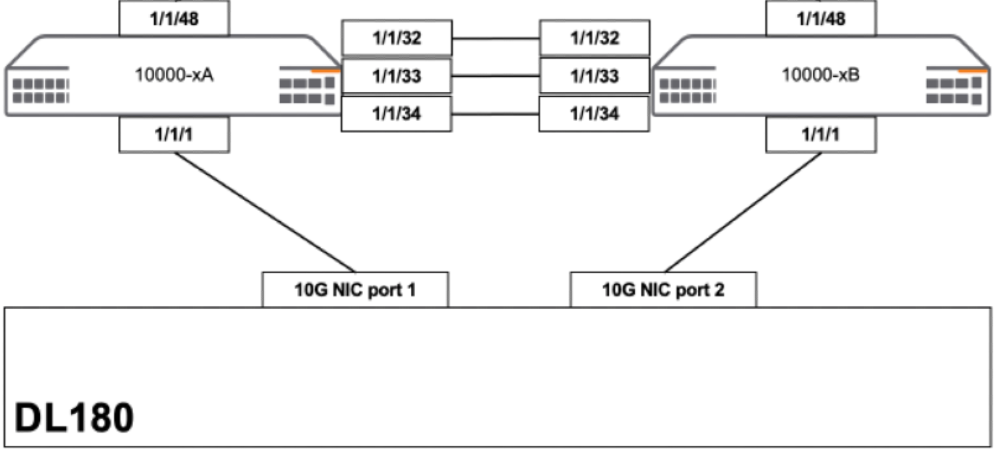
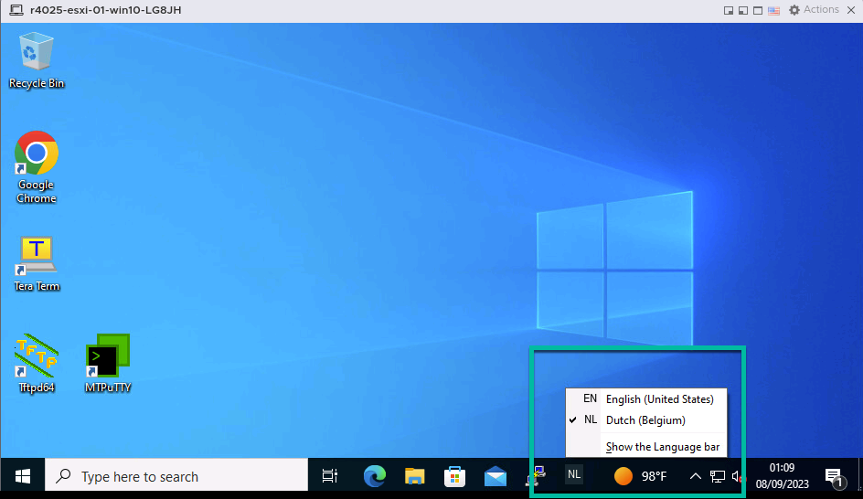
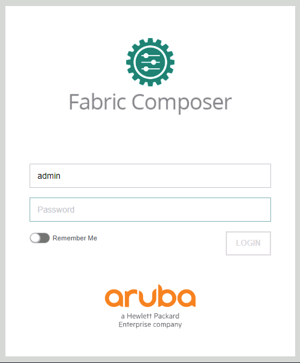

Confidential | For Training Purposes Only

# Lab 1 - Accessing the Lab

## Lab Overview

Lab time:  15 minutes

In this lab, we are going to explore the lab environment and access the various components of the lab.  The lab consists of the following components:
* 2x CX 10000 Switches
* 1 ProLiant Server


_Fig. Lab Physical Layout_


```{note}
The last number of your workshop will be used to determine you lab group number. If you are user1 then your lab group number will be 01. If your userid ends with 10, then you lab grpoup number is 10. You will use the lab group number through out the workshop.
```

### Expected Results

Once inside, you will be connected via https and RDP to a Windows 10 machine that will work as your lab platform. In the rest of this guide, all applications mentioned run on this VM unless a different platform is specified.


<b>A word about the keyboard</b>  
This Hands On Lab is accessed by many engineers all around the world. Look in the tool bar at the bottom of the screen of your student jump host and select the language you normally use. Do not move on until this step is verified!

  
_Fig. Lab 1 Windows Language_  

All activities will be conducted using the Chrome browser on this machine, except for a few accesses to the console of the switches that can be done via MTputty. In this first activity you will use Fabric Composer to:  
* Discover the switches
* Create a fabric
* Add the switches to the fabric
* Configure NTP and DNS services on the switches  


## Lab 1.3 - Lab Details and Accessing the Aruba Fabric Composer

### Description
This is a table of all the IP addresses in your lab group. This is where you will you find your lab group assignment. The 3rd octet of the IP address will be the number "2" + you lab group number. If you have been assigned Lab 2 (ie. User2) then 202 is the 3rd octet.

<b>Management IP Addresses</b>

| DEVICE    | INTERFACE | IP ADDRESS  |  
| -------- | ------- | ------- |
| Aruba Fabric Composer (AFC) | Managment | 10.250.2<span style="color:orange">**[LG]**</span>.30 |
| Pensando PSM | Managment | 10.250.2<span style="color:orange">**[LG]**</span>.31 |
| LGXX-spine01 | Managment | 10.250.2<span style="color:orange">**[LG]**</span>.103 |
| LGXX-leaf01 | Managment | 10.250.2<span style="color:orange">**[LG]**</span>.101 |
| LGXX-leaf02 | Managment | 10.250.2<span style="color:orange">**[LG]**</span>.102 |
| Workload-01 | Managment | 10.250.2<span style="color:orange">**[LG]**</span>.201 |
| Workload-02 | Managment | 10.250.2<span style="color:orange">**[LG]**</span>.202 |
| Workload-03 | Managment | 10.250.2<span style="color:orange">**[LG]**</span>.203 |


### Validate
1. Open the browser on the lab Windows machine
2. Navigate to the Fabric Composer using the following URL:  https://10.250.2LG.30/

<span style="color:orange">***Make sure to replace LG with your Lab Group Number in the URL***</span>  

3. Log in using the following credentials:  
**Username:**  ``admin``  
**Password:**  ``admin``  


  
_Fig. Lab 1 AFC Login_


### Expected Results

After supplying the credentials to AFC you will see the dashboard.