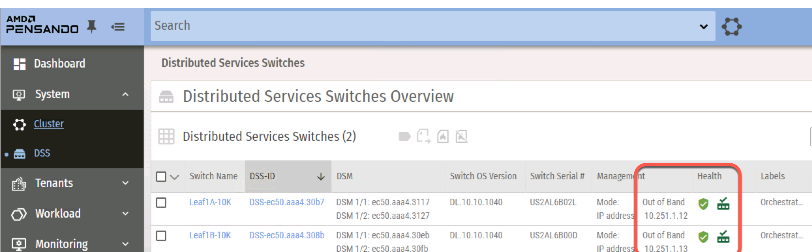

Confidential | For Training Purposes Only

# Lab 4 - AFC Integrations

## Lab Overview

Lab time:  40 minutes

The AFC is a powerful platform for managing a Data Center Switching Fabric.  It was designed to not only manage and integrate with HPE Aruba Data Center products, but also with 3rd party platforms such as VMware vSphere, Nutanix, AMD Pensando, and much more.

In this lab, we are going to use the Aruba Fabric Composer (AFC) to build the following integrations:

* Integrate with vSphere
* Integrate with AMD Pensando Policy and Services Manager (PSM)


## Lab 4.1 - Integrate vSphere

### Description
Using the AFC we will add an integration with VMware vSphere.  This integration provides ...

### Validate
1. Open the AFC, click the **Configuration** menu, and select **Integrations** > **VMware vSphere**

  
_Fig. Lab 4 Integrations Menu_  

2. Using the **ACTIONS** menu, select **Add**.

  
_Fig. Lab 4 Add Integration_  

3. Add the vSphere integration by entering the following information in the form:  

|   |   |
|---|---|
|**Step 1 - Host**|  |
| Name | dsf-vsphere |
| Description | vSphere Cluster |
| Host | ``10.250.0.50`` |  
| Username | ``lg[LG]@vsphere.local`` |  
| Password | ``Aruba123!@#`` |  
| ***Click VALIDATE and NEXT***||

|   |   |
|---|---|
|**Step 2 - Aruba Fabric**|  |
| Automate VLAN provisioning for ESX hosts directly connected to the fabric | YES |
| Automate VLAN provisioning for ESX hosts connected through intermediate ... | NO |
| Automated PVLAN provisioning for ESX hosts directly connected to the fabric ... | YES |  
| Automated Endpoint Group Provisioning * | YES |  
| ***Click NEXT***||

|   |   |
|---|---|
|**Step 3 - vSphere**|  |
| Discovery Protocols | YES |
| ***Click NEXT***||

|   |   |
|---|---|
|**Step 4 - Summary**|  |
| Review the summary and then ***Click APPLY***||


### Expected Results

Verify that the integration is successfully connected as shown in the following screenshot.  

  
_Fig. Lab 4 Connected vSphere_   


## Lab 4.2 - AFC Host Visualization

### Description  
Once vSphere is integrated with AFC, AFC will use RESTful APIs to poll vSphere to gather an inventory of hosts, VMs, Networks, etc.  We will explore the AFC Host Visualization in this lab.

### Validate  
1. Open the AFC, click the **Visualization** menu, and select **Hosts**

  
_Fig. Lab 4 Visualizations Menu_  

2. At the bottom of the page go to the **VM** list (Click VMS) find and select your lab-groups workload servers. **LG[LG]WL01-v10-101** and **LG[LG]-WL02-v10-102**.  

```{note}
You may have to expand the lower part of the screen to access this list.  In this example, LG01 VM's are selected.
```

  
_Fig. Lab 4 VM Workload List_  

```{note}
AFC Host Visualization defaults to Lab Group 01. Be sure to select your lab to see your diagram. Your lab will be 10.250.0.1**LG**, where **LG** is your Lab Group Number.  You may have to expand the lower part of the screen to access the list.  *LG01 VM's are selected in this example*  
```

  
_Fig. Lab 4 Host Visualization_  


### Expected Results  

Verify that the host address matches the one connected to your switches. Use the following table as reference.


| Lab Group | vSphere Host | Lab Group | vSphere Host | 
|---|---| ---|---|
| 01 | 10.250.0.101 | 06 | 10.250.0.106 |
| 02 | 10.250.0.102 | 07 | 10.250.0.107 |
| 03 | 10.250.0.103 | 08 | 10.250.0.108 |
| 04 | 10.250.0.104 | 09 | 10.250.0.109 |
| 05 | 10.250.0.105 | 10 | 10.250.0.110 |

```{note} 
Verify you see the physical connections to your leaf group. If you do not see the connections, the ports may be down on the switches. You can use show interface brief on the command line of the switch and look for port 1/1/1 on each switch.  
```

## Lab 4.3 - Integrate PSM 

### Description
Using the AFC we will now add an integration with the AMD Pensando Policy and Services Manager (PSM).  PSM provides centralized management and visibility of all stateful services running in the infrastructure.  AFC acts as an abstraction layer for some of the PSM stateful functions.

### Validate
1. Open the AFC, click the **Configuration** menu, and select **Integrations** > **Pensando PSM**

  
_Fig. Lab 4 Integrations Menu_  

2. Use the **ACTIONS** menu to select **Add**  

  
_Fig. Lab 4 Add Integration_  

3. Add the Pensando PSM Integration by entering the following information in the form:  

|   |   |
|---|---|
|**Step 1 - Host**|  |
| Name | dsf-psm |
| Description | Policy and Services Manager |
| Host | ``10.250.2[LG].31`` - where **LG** is your labgroup number |  
| Username | ``admin`` |  
| Password | ``Pensando0$`` (Pensando + zero + dollar)|  
| ***Click VALIDATE and NEXT***||

|   |   |
|---|---|
|**Step 2 - Settings**|  |
| Fabric | dsf |
| Enable auto decommissioning for switches deleted from the system | YES |
| Enable auto VLAN placement on all switches when creating a Network | YES |  
| VMware vCenters | Select the vSphere server |  
| ***NEXT***||

|   |   |
|---|---|
|**Step 4 - Summary**|  |
| Review the summary and then ***Click APPLY***||  

### Expected Results

Verify that the integration is successfully connected and **HEALTHY** as shown in the following screenshot.  

  
_Fig. Lab 4 Connected PSM_   

```{note}
If the health is not green, wait a few moments and refresh the page.  
```

## Lab 4.4 - Access PSM 

### Description  
We will log into the PSM to verify that the the AFC integration was successful.  AFC should have added the two CX 10000 Switches (also called Distributed Services Switch or DSS) to the PSM.

### Validate
Using the web browser in your RDP client, open the PSM using the following URL and credentials:  

**URL:**  https://10.250.2LG.31  
**Username:**  ``admin``  
**Password:**  ``Pensando0$``  

  
_Fig. Lab 4 PSM Login_   

### Expected Results
Once logged into the PSM, navigate to **System** > **DSS** and verify that the CX 10000 Switches are in the healthy state.

  
_Fig. Lab 4 DSS Overview_   

## Lab 4 Summary

- During this lab, we added third party integrations to the Aruba Fabric Composer  
- We added an integration to vSphere from AFC
  - We verified the integration, by using the Host Visualization feature in the AFC
- We added an integration with the AMD Policy and Services Manager  
- We accessed the PSM to verify that the integration was successful and that both CX 10000 switches were added by AFC to PSM  
