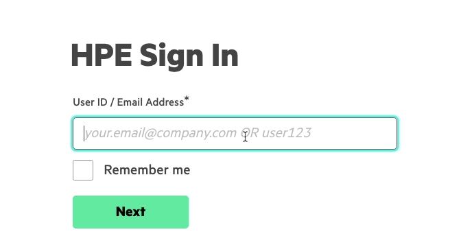
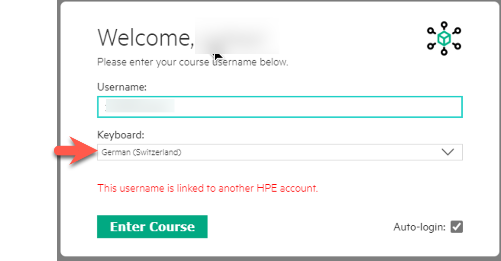
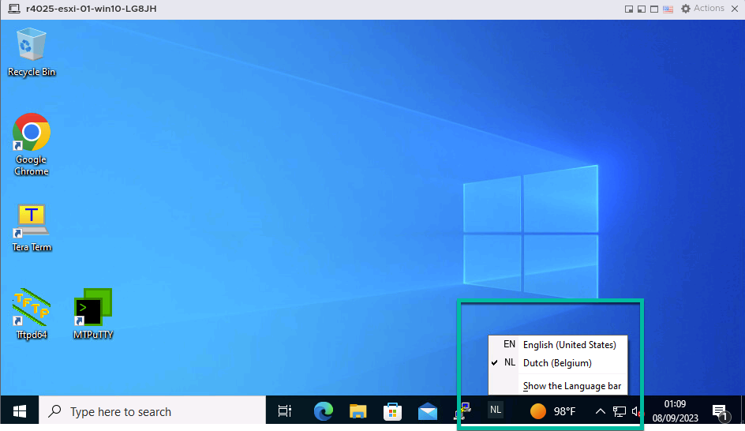
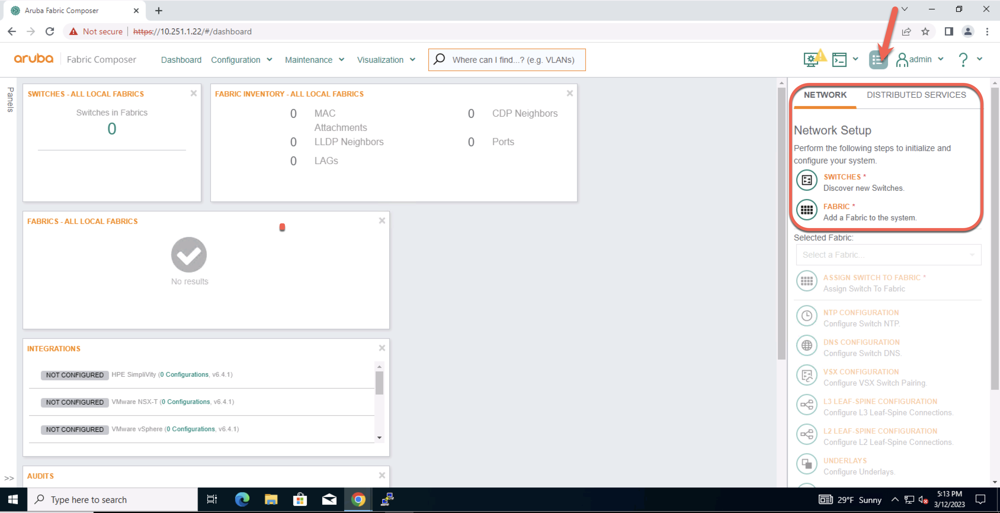
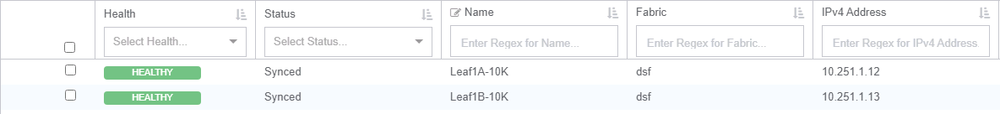
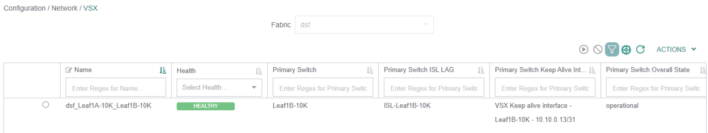
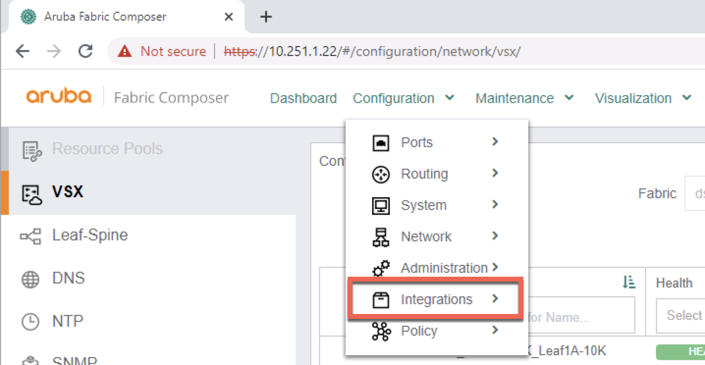

# Lab 4 - Test the Policy  

## Lab Overview
Lab time:  30 minutes 

### Description  

In preparing for this lab, a pair of distributed virtual switches have been created. One connects to the **Leaf1A-10K** and the other connects to **Leaf1B-10K**. Proper connections have been made in advance. WL01 and WL02 are in vlan 10 port group, and WL03 is in vlan 20 port group.
At this point of the lab. All traffic between the endpoint groups should be blocked except ssh from **workload01** & **workload02** to **workload03**. Open up a SSH session on all of the workloads.

## Validate

## Lab 4.1 - Test Firewall Rules  

1. On the desktop, in the windows search bar (bottom left of screen) enter CMD to open a command window. Use SSH to connect to **all** the workloads out-of-band-management interface. 

|||||
|---|---|---|---|
| WL-Name | User Name | Password | Address
| Workload01 | arubatm | admin | 10.250.2<span style="color:orange">**[LG]**</span>.201 | 
| Workload01 | arubatm | admin | 10.250.2<span style="color:orange">**[LG]**</span>.201 | 
| Workload01 | arubatm | admin | 10.250.2<span style="color:orange">**[LG]**</span>.201 | 

<hr>
<br>

Enter these commands on the jumphost.
<br>

``C:\Users\Admin> ssh arubatm@10.250.2LG.201 ``
``C:\Users\Admin> ssh arubatm@10.250.2LG.202 ``
``C:\Users\Admin> ssh arubatm@10.250.2LG.203 ``

  
_Fig. 3 SSH sessions_

2. Once logged into **Workload01**. Try to ping **10.0.20.101**, this should fail. Use **CRTL+C** to exit the ping.

  
_Fig. SSH Succeeded_

3. Try to **ssh** to **10.0.20.101**.  (ssh arubatm@10.0.20.101)

  
_Fig. SSH Succeeded_

```If your ssh fails, check the routes in the workstations!```

4. Check workload 1:
arubatm@workload-v10-101:
 **ip route**

   
_Fig. ip routes_

**Workload-v10-101** seems to have a route to the 10.0.20.0/24 network. If the route is not there, add it.
Enter **sudo ip route add 10.0.20.0/24 via 10.0.10.1** (password: admin)

5. Check workload 2:
arubatm@workload-v10-102:
 ip route

    
_Fig. ip routes_

**Workload-v10-102** needs to have a route to get to the **10.0.20.0/24a** network. 
If it’s not there, add it. Enter **sudo ip route add 10.0.20.0/24 via 10.0.10.1** (password: admin)


6. Check workload 3:
arubatm@workload-v20-101: 
ip route

**Workload-v12-101** needs to have a route to get back to the **10.0.10.0/24** network. 
Enter **sudo ip route add 10.0.10.0/24 via 10.0.20.1** (password: admin)

    
_Fig. ip routes_


### SSH for workload 2 and 3

1. Move to **Workload02**. Try to ssh to **10.0.20.101** this should succeed. 

```{note}
The policy created earlier in the lab allows SSH from the WEB endpoint group to the DATABASE endpoint group. It BLOCKS all other traffic.
```
2. Move to **Workload03**. Try to ssh to **10.0.10.101** this should fail. Use CRTL+C to exit. There is no rule to allow ssh from the database server endpoint group.


## Lab 4.2 - Permit ssh from database to web endpoint group

A rule will have to be added to our ingress and egress policies to permit SSH from the **DATABASE** endpoint group to the **WEB** endpoint group.

### Validate

1. Go back to the Aruba Fabric Composer window and navigate to **Configuration/Policy/Rules**

  
_Fig. Rules_

### Create the allow-db-ssh-web rule

_Fig. Rule Worklow_  

|||  
|---|---|  
| Step 1: Name ||  
| Name | allow-ssh-db-web |  
| Description | Allow SSH between Database and Web Servers |  
| Click **NEXT** to continue ||  

|||  
|---|---|  
| Step 2: Settings ||  
| Type | Layer 3 |  
| Action | Allow ***(default setting)*** |  
| Click **NEXT** to continue ||  

|||  
|---|---|  
| Step 3: Endpoint Groups ||  
| Source Endpoint Group | Database-Servers |  
| Destination Endpoint Group | Web-Servers |  
| Click **NEXT** to continue ||  

|||  
|---|---|  
| Step 4: Applications and Service Qualifiers  ||  
| Applications | ***leave empty*** |  
| Service Qualifiers | SSH ***(type ssh)*** |  
| Click **NEXT** to continue ||  
| Review the Summary and click **Apply** ||  

## Expected Results

On the screen you will see a new rule. Next task is to add this rule to the ingress and egress policy.

  
_Fig. New Rule_

## Lab 4.3 Modify the egress policy with the new rule

1. Navigate to Configuration/Policy/Policies 

2. Select the **egress** policy and from the **Actions** menu choose edit. 

  
_Fig. Edit Egress Policy_

3. Click on the **rules** tab at the top of the dialog. Then **Add/Existing**.

  
_Fig. Add Existing Rule_

4. Click on the **allow-ssh-db-web** rule and click **Apply**.

  
_Fig. Select Rule_

5. Make sure the rules appear like the next diagram shows. The allow SSH rules must be **at the top** of the rule list. Click **APPLY**.

  
_Fig. Rule Position_

## Lab 4.4 Modify the ingress policy with the new rule

1. Navigate to Configuration/Policy/Policies 

2. Select the **ingress** policy and from the **Actions** menu choose edit. 

  
_Fig. Edit Egress Policy_

3. Click on the **rules** tab at the top of the dialog. Then **Add/Existing**.

  
_Fig. Add Existing Rule_

4. Click on the **allow-ssh-db-web** rule and click **Apply**.

  
_Fig. Select Rule_

5. Make sure the rules appear like the next diagram shows. The allow SSH rules must be **at the top** of the rule list. Click **APPLY**.

  
_Fig. Rule Position_

## Lab 4.5 Test new rule

1. Return to the SSH sessions that have been established to each workload.

2. Once logged into **Workload03** try to ping **10.0.10.101**, this should fail. Use CRTL+C to exit the ping.

  
_Fig. Ping Fails_

3. From **workload03** try to SSH to **Workload01**. 

### Expected Results 

You can see that the ssh session is succesful. If not, go back and check the rule order.

  
_Fig. ssh works_


