Confidential | For Training Purposes Only

# Lab 5 - Microsegmentation

## Lab Overview

Lab time:  40 minutes

In the previous labs, we built a fabric, attached switches, and added integrations with vSphere and the PSM.  There are several workload VMs running in each lab and during this lab, we will levarage the integrations to build firewall policies to microsegment the workloads from each other.

## Lab 5.1 - Create Endpoint Group for Workloads

### Description
In this task, you will create 2 endpoint groups. An endpoint group in Fabric Composer is a set of VMs that have the same set of policy rules.

### Validate

1. Using the AFC, select **Policy** and then **Enpoint Groups** from the top level menu

  
_Fig. Lab 5 Endpoint Groups Menu_  

2. From the **ACTIONS** menu, select **Add**  
If there are existing endpoint groups, just ignore them.

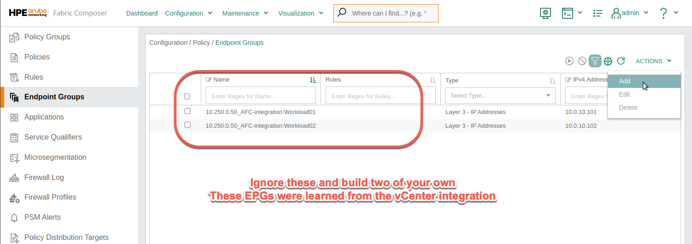  
_Fig. Lab 5 Add Endpoint Group_  

3. Create an Endpoint Group for Workload01

|   |   |
|---|---|
|**Step 1 - Name**| |
| Name | WL-group-01 |
| Description | (optional) |
| ***Click NEXT*** | |

|   |   |
|---|---|
|**Step 2 - Type** |
| Type | Layer 3 - IP Address |
| ***Click NEXT*** | |

|   |   |
|---|---|
|**Step 3 - Endpoints** |
| VM/VNIC/VMKernel Endpoint | Yes (selected) |
| Criteria | VM Tag* (select from the pull down menu) |
| VM Tag | ``AFC-Integration.Workload01`` (Look for your **Lab Group** Number) |
| VNIC | Select any ***Network Adapter 2*** with ``10.0.10.101`` |
| Scroll down, ***click ADD, NEXT and APPLY*** | |

Look for your workload number and verify it is assigned to your lab group!

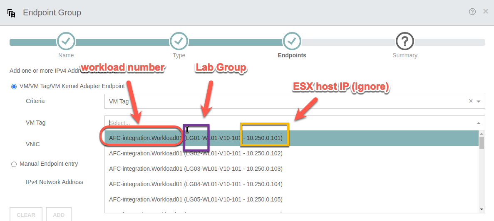  
_Fig. Choose Wisely_  


4. From the **ACTIONS** menu, select **Add** to create an Endpoint Group for Workload02

|   |   |
|---|---|
|**Step 1 - Name**| |
| Name | WL-group-02 |
| Description | (optional) |
| ***Click NEXT*** | |

|   |   |
|---|---|
|**Step 2 - Type** |
| Type | Layer 3 - IP Address |
| ***Click NEXT*** | |

|   |   |
|---|---|
|**Step 3 - Endpoints** |
| VM/VNIC/VMKernel Endpoint | Yes (selected) |
| Criteria | VM Tag* (select from the pull down menu) |
| VM Tag | ``AFC-Integration.Workload02`` (Look for your **Lab Group** Number) |
| VNIC | Select any ***Network Adapter 2*** with ``10.0.10.102`` |
| Scroll down, ***click ADD, NEXT and APPLY*** | |

### Expected Results
The Endpoint Groups should have been created based on VM Tag and visible in the list.

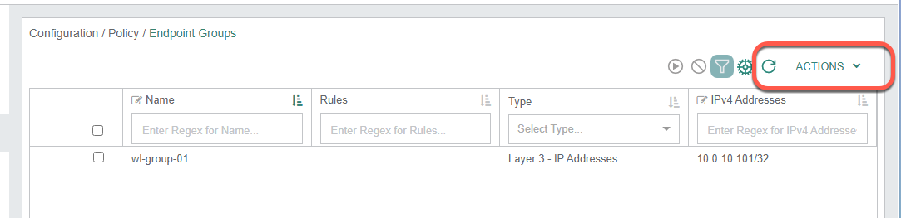  
_Fig. Two complete Endpoint Groups_  

## Lab 5.2 - Create Firewall Rule

### Description
When enabling Microsegmentation, an explicit Deny All rule is placed at the bottom of the rule list, which acts as a catch all. For the purpose of these labs and in order to test the Switch Firewalling functionality, we will place an **Allow All** rule at the bottom, and add specific Deny rules above it.

### Validate

1. Using the AFC, select **Policy** and then **Rules** from the top level menu, or if still visible, select **Rules** from the left menu.

2. From the **ACTIONS** menu, select **Add** to add a new Rule

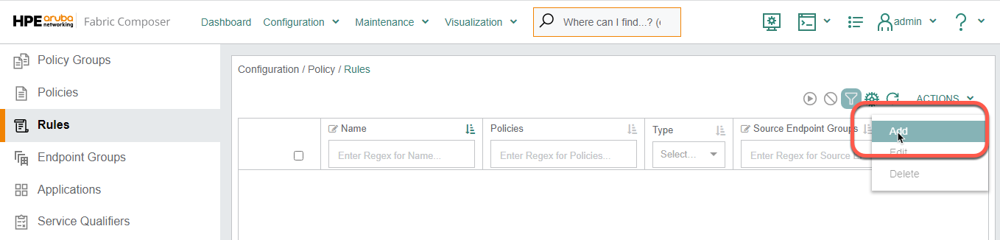  
_Fig. Lab 5 Add Endpoint Group_  

|   |   |
|---|---|
|**Step 1 - Name**| |
| Name | allow_all_v10 |
| Description | (optional) |
| ***Click NEXT*** | |

|   |   |
|---|---|
|**Step 2 - Settings**| |
| Type | Layer 3 |
| Action | Allow |
| ***Click NEXT*** | |

|   |   |
|---|---|
|**Step 3 - Endpoint Groups**| |
| Source Endpoint Groups | ``WL-group-01`` and ``WL-group-02`` |
| Destination Endpoint Groups | ``WL-group-01`` and ``WL-group-02`` |
| ***Click NEXT*** | |

|   |   |
|---|---|
|**Step 4 - Applications and Service Qualifiers**| |
| Applications | (leave empty) |
| Service Qualifiers | (leave empty) |
| ***Click NEXT*** | |
| Review the summary and ***APPLY*** | |

### Expected Results
The Allow All rule should be successfully created and visible in the list of Rules.


## Lab 5.3 - Create Firewall Policy

### Description
Firewall Rules are placed in Policies and are enforced in a top to bottom fashion.  We will create a Policy in this lab, and assign our Allow All rule to it.

### Validate

1. Using the AFC, select **Policy** and then **Policies** from the top level menu, or if still visible, select **Policies** from the left menu.

2. From the **ACTIONS** menu, select **Add** to add a new Rule
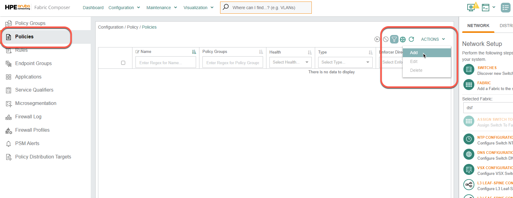  
_Fig. Adding a policy_  

|   |   |
|---|---|
|**Step 1 - Name**| |
| Name | dsf-leaf**LG**01 |
| Description | (optional) |
| ***Click NEXT*** | |

|   |   |
|---|---|
|**Step 2 - Settings**| |
| Type | _Distributed Firewall *_ |
| ***Click NEXT*** | |

```{note}
* For other CX switches, that are non CX-10K, you can use this same procedure to
configure L2 or L3 ACLs
```

|   |
|---|
|**Step 3 - Rules** |
| Go to **ACTIONS / ADD / Existing** (top right of this form) |
| 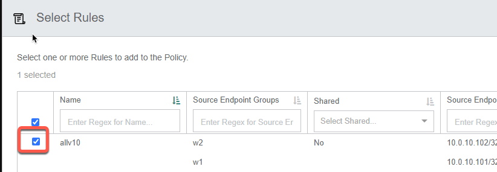 |
| ***Click APPLY*** |
|  |
| ***If you don’t select this there will only be an implicit deny all rule in the policy and nothing will ping!*** |
| ***Click NEXT*** |

|   |   |   |
|---|---|---|
|**Step 4 - Enforcers**| | |
| Fabric | dsf | |
| Policy Distribution Target Type | Select **LEAF** from the dropdown | |
| Direction | Egress (direction is selected from the point of view of the workload/host) | |
| VRF | default | |
| Networks | Select **ADD** on the right side of this option to add the network (one or more VLANs) | |
| | ***Sub-step A - Name*** | |
| | Name | VLAN10 |
| | Description | (optional) |
| | ***Click NEXT***  | |
| | ***Sub-step B - Settings*** | |
| | VLAN | 10 |
| | ***Click NEXT*** | |
| | Review the Summary and ***APPLY*** | |
| Scroll down, click ***ADD*** (at bottom of dialog) and ***NEXT*** | | |
| Review the Summary and ***APPLY*** | | |


### Expected Results
The newly created Policy should appear in the Policy list (see screenshot below).

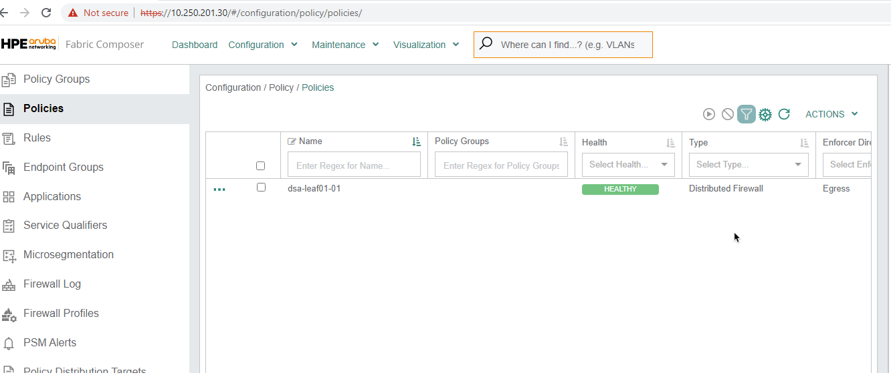  
_Fig. Lab 5 Policy List_  


## Lab 5.4 - Configure Microsegmentation

### Description
A microsegmentation is a set of configurations starting with a private/isolated VLAN on the host that extends to the switch. On the switch, that VLAN is redirected to the Pensando DSM processor for policy enforcement.  

We will use the Microsegmentation Configuration in Fabric Composer which will:
- Creates, on the host:
  - A Distributed Virtual Switch
  - Two Port Groups:  one for the private primary VLAN and another for the isolated VLAN 
- Creates, between the host and the Switches:
  - A Link Aggregation Group transporting that VLAN (as a promiscuous port)

### Validate

1. Using the AFC, we will use the Guided Setup menu on the right side.  Go to **DISTRIBUTED SERVICES** and select **CONFIGURE MICROSEGMENTATION**  

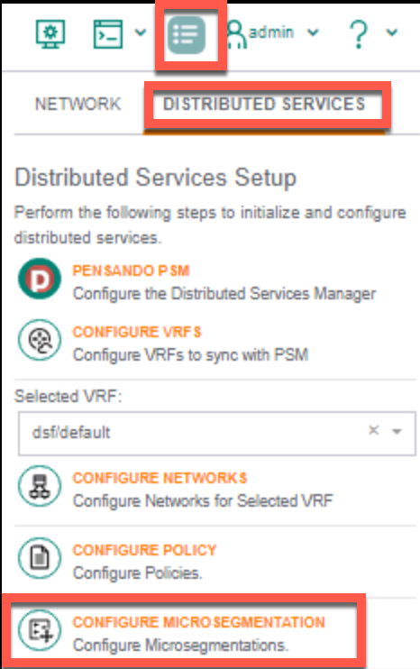  
_Fig. Lab 5 Configure Microsegmentation_  


|   |   |
|---|---|
|**Step 1 - Settings**| |
| Name (dvswitch) | dsf-leaf**LG** (LG = Lab Group Number) |
| Host | Enter the address of your host (see table below) |  
| NICs | vmnic6 and vmnic7 |
| ***Click ADD and NEXT*** | |

| Lab Group | vSphere Host | Lab Group | vSphere Host | 
|---|---| ---|---|
| 01 | 10.250.0.101 | 06 | 10.250.0.106 |
| 02 | 10.250.0.102 | 07 | 10.250.0.107 |
| 03 | 10.250.0.103 | 08 | 10.250.0.108 |
| 04 | 10.250.0.104 | 09 | 10.250.0.109 |
| 05 | 10.250.0.105 | 10 | 10.250.0.110 |

|   |   |
|---|---|
|**Step 2 - PVLAN**| |
| Portgroup Name Prefix | dsf-leaf**LG** (LG = Lab Group Number) |
| Primary VLAN | 10 |  
| Primary VLAN NICS | **(do NOT select any)** |  
| Isolated VLAN | 11 |  
| Isolated VLAN NICS | Click **SELECT VNICS** |  
| | Scroll down, select both Network Adapter 2 with IP address: ``10.0.10.101`` and ``10.0.10.102`` |
| | _Note: workloads must be connected to the isolated VLAN_
| | 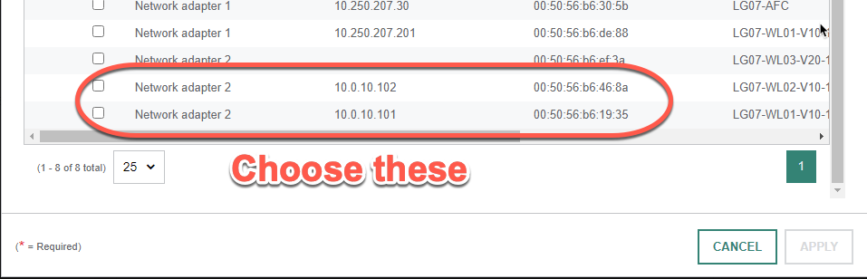  
 

| ***Click NEXT*** | |

|   |   |
|---|---|
|**Step 3 - Fabric**| |
| Fabric | dsf |
| ***Click NEXT*** | |


|   |   |
|---|---|
|**Step 4 - LAGs**| |
| | 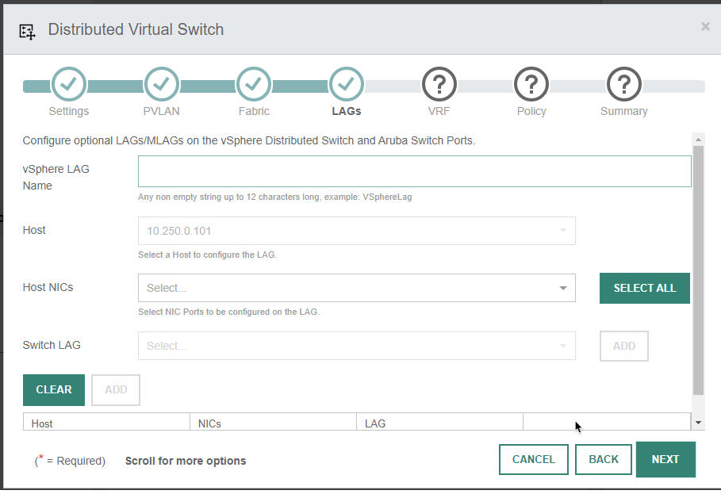  |
| vSphere LAG Name | dsf_lag_lg**LG** |
| Host | (pull down menu and use the pre-populated address) |
| Host NICS | vmnic6 and vmnic7 | 
| Switch LAG | Click **ADD** on the right to configure the LAG on the CX10k VSX pair |

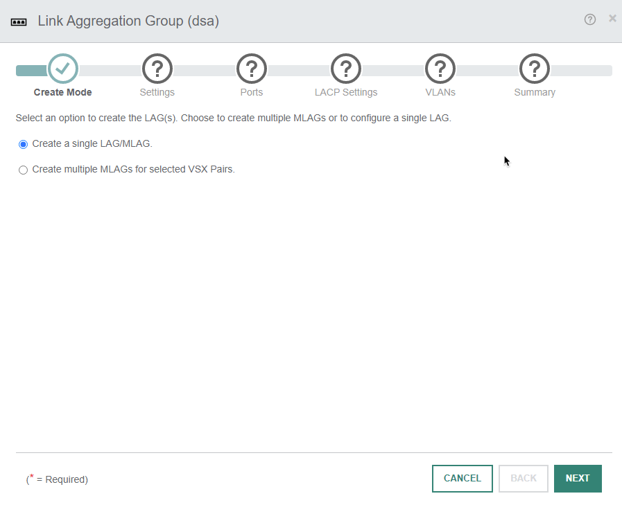

|   |   |   |
|---|---|---|
| | **Sub-step A - Settings** | |
| | Create Mode | Create a single LAG/MLAG _(default)_ |
| | ***Click NEXT*** | |
| | Name | ``dsf_lag_lgLG-10.250.0.10LG`` _(pre-populated)_ |
| | Description | (optional) |
| | LAG Number | 31 |
| | Inter-Switch Link | **Check it! (if not greyed out)** |
| | ***Click NEXT*** | |
| | **Sub-step B - Ports** | |
| | LAG Switch Member | ``dsf_LGLG-Leaf01A-Leaf01B`` |

```{note}
Select the LAG Switch Member and then click the small picture icon as highlighted in the following screenshot to view the port selection on the switches
```
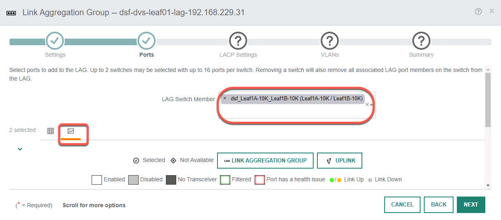
```{note}
Select the switch ports as highlighted in the following screenshot
```
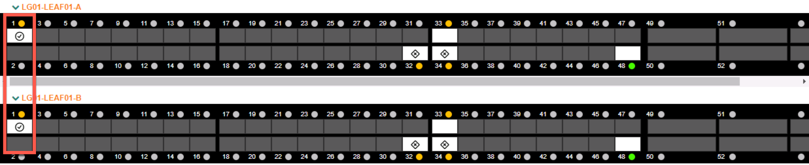

|   |   |   |
|---|---|---|
| | Click ***NEXT*** after port selection _(see screenshots above)_| |
| | **Sub-step C - LACP Settings** | |
| | Review and ***click NEXT*** | |
| | **Sub-step D - VLANs** | |
| | VLANs | **10,11** (should be populated) |
| | ***Click NEXT and APPLY*** |
| | In the DVS Task main window, ***click ADD*** at the bottom left |

|   |
|---|
|**Step 5 - VRF**|
| Leave emtpy and click ***NEXT*** |

|   |
|---|
|**Step 6 - Policy**|
| Leave emtpy and click ***NEXT*** |

|   |
|---|
|**Step 7 - Summary**|
| Review the Summary and click ***APPLY*** |

### Expected Results

To confirm that Microsegmentation has been properly configured, click ***Visualization / Hosts*** from the top menu.  

On the left side fo the map, under **Settings**, you can use the **Zoom Out** function until you can see the whole diagram.  Also under **Settings**, select **Name Truncation: None**  

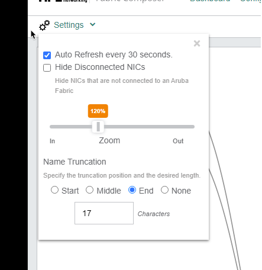  
_Fig. Lab 5 Diagram Settings_  

Check the diagram to verify the connections and make sure you are looking at your specific Lab Group.  

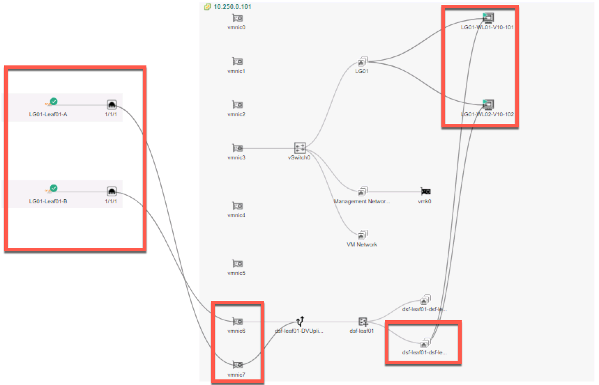  
_Fig. Lab 5 Host Visualization_  

```{note}
The VMs are connected to the Isolated VLAN 11 port group. And now you see the switch connections
```

## Lab 5 Summary

- During this lab, we enabled microsegmentation on the CX 10000 switches  
- We created Endpoint Groups for each of the workloads running in the lab  
  - We used VM Tags for matching to demostrate how to create dynamic firewall rules
- We created an Allow All firewall rule  
- We created a firewall policy and added the Allow All rule to that policy  
- We use the AFC to activate Microsegmentation  
  - We created a Private VLAN and added our test workload vNICs to this new Private VLAN  to ensure VM isolation 

## Lab 5 Learning Check 

- Endpoint Groups can be created manually or automatically learned from VMware
- Rules are added to policies. 
- Policies are atuomatically sent to the AMD Pensando Policy Services Manager(PSM)
- PSM programs the DPU chips on the HPE Aruba CX 10000 switch


 